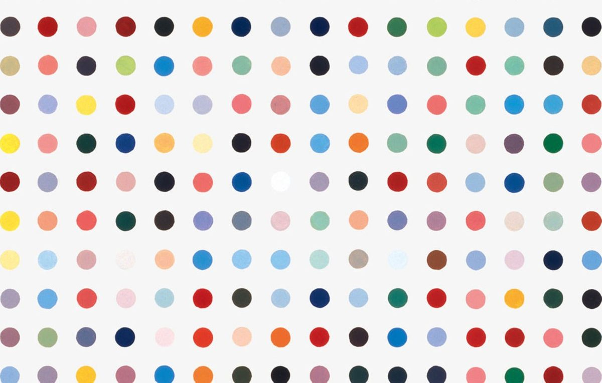

# Hirst Painting

A Python recreation of Damien Hirst's iconic **spot paintings**, generating a 15×15 grid of colourful dots using the `turtle` graphics library.



## Features

- Draws a 225-dot (15×15) grid with randomly selected colours
- Colour palette extracted from a real Hirst-style reference image via `colorgram`
- Saves the finished artwork as a PostScript (`.ps`) file
- Simple, dependency-light Python script

## Prerequisites

- Python 3.7+
- [pip](https://pip.pypa.io/en/stable/)

## Installation

1. **Clone the repository**

   ```bash
   git clone https://github.com/mandalorian-0/hirst_painting.git
   cd hirst_painting
   ```

2. **Install dependencies**

   ```bash
   pip install -r requirements.txt
   ```

   | Package | Version |
   |---------|---------|
   | colorgram.py | 1.2.0 |
   | Pillow | 12.1.0 |

## Usage

Run the main script:

```bash
python main.py
```

A Turtle graphics window (800×800 px) will open and draw the painting. When finished, the artwork is saved to `my_drawing.ps` in the project directory.

## Output

The script produces a PostScript file (`my_drawing.ps`) that can be opened with most document viewers or converted to PDF/PNG with tools such as Ghostscript:

```bash
gs -dBATCH -dNOPAUSE -sDEVICE=png16m -sOutputFile=my_drawing.png my_drawing.ps
```

## How It Works

1. A fixed palette of 25 colours is sampled from the reference image using `colorgram`.
2. A `turtle.Turtle` instance starts at the bottom-left of the canvas.
3. It moves right, placing a dot every 50 px, and advances up one row every 15 dots.
4. Each dot colour is chosen at random from the palette.
5. The completed canvas is saved as a PostScript file.

## License

This project is licensed under the terms of the [LICENSE](LICENSE) file included in this repository.
